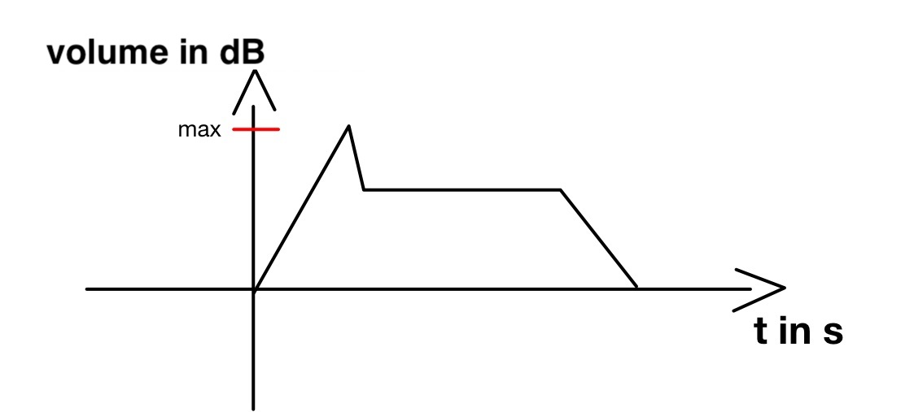

# Control logic
The task is to control the VCA (Voltage Controlled Amplifier) and the VCO (Voltage Controlled Oscillator) with an ATmega8 microcontroller and to produce sounds for a self-made alarm clock. 
The output will drive the VCA and VCO to produce a varying tone.

Two signals are required as input. A digital signal that will tell the alarm clock to sound. 
This signal is either 0 or 1, at 1 there should be tones, at 0 not. 
As soon as this signal is detected by the microcontroller, the second signal, which indicates the volume, is listened for. 
This signal is analog and is converted into a digital value by the built-in ADC. 
This value is then the maximum volume level for the sound. The alarm tone itself will play like a piano key in terms of volume amplitude, with the read-in analog input value as the maximum volume point, as shown in the following figure. 
The value is then output digitally, in 8 bits, to a digital-to-analog converter, whereupon the analog signal is passed to the VCA to control how much amplification it should provide.

Volume curve of the alarm tone amplified by the VCA:

The digital on/off signal determines both the time for which the sound is to be generated and that the sound is output at all. 
As long as there is a signal at the corresponding pin of the microcontroller, the sound should be output. 
This again causes the microcontroller to send an 8-bit digital signal to the digital-to-analog converter, which then passes the analog signal to the VCO. 
You can vary the frequency of the signal produced by the VCO, and therefore the frequency of the sound produced, by varying this digital signal from the microcontroller. 
This way different sounds can be created and even songs can be played.
